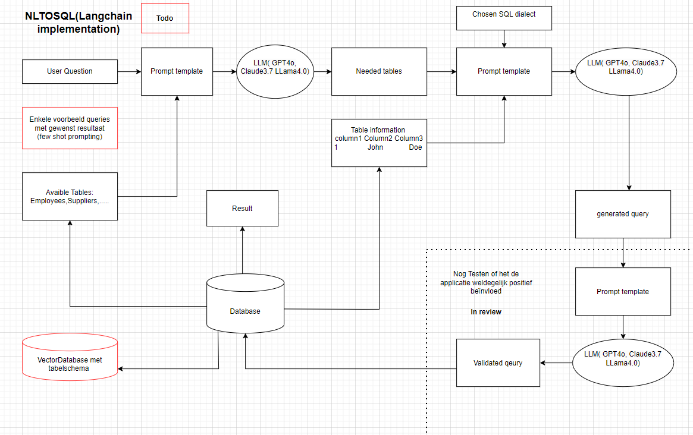

# Stage Xander Van der Linden

## NL2SQL application

Basic NL2SQL apllication. designed to generates sql queries on a sample database. The sample database can be in any dialect of your choice. It utilizes the use of llm's through agents and dynamically gets the relevant tables(schema linking) through an llm call. Then it gets the necesary information from these tables and gives a few example rows and a structure from these tables. When The prompt returns the sql the sql is then validated to make sure it doesn't contain frequently made sql errors. Then this cleaned query is given as input to the database and we get the sreturned rows. The user then gets this prompt in natural language with the desired result.



main.py = Streamlit interface runnen
Prompts.py = prompt templates gebruikt om de agents aan te roepen
table_details = gebruikt om dynamisch tabellen op te roepen uit de db
langchain_utils.py = gebruikt voor de chains te definieren (oproepen naar llm logica)
examples.py = implementatie few-shot prompting

## bird notebook

Playground voor het uittesten van technieken

## Minidev

Mapje met json bestanden met training data en csv bestanden met kolom/tabelnamen bird benchmark

## dependencies (nog toevoegen)

```bash
pip install -r requirments.txt
```

## requirements

- **Python3.x** 
- **Pydantic**
- **Langchain**

## usage

virtual enviroment activation (only for myself)

```bash
C:\Users\Xander\IntoData\IntoDataStage\Stage\.venv310\Scripts\Activate.ps1
```

Running main streamlit

```bash
streamlit run \langchain app\main.py 
```

this open up the interface on a local url and on a network url
example:

  Local URL: <http://localhost:8501>
  Network URL: <http://10.150.136.22:8501>
